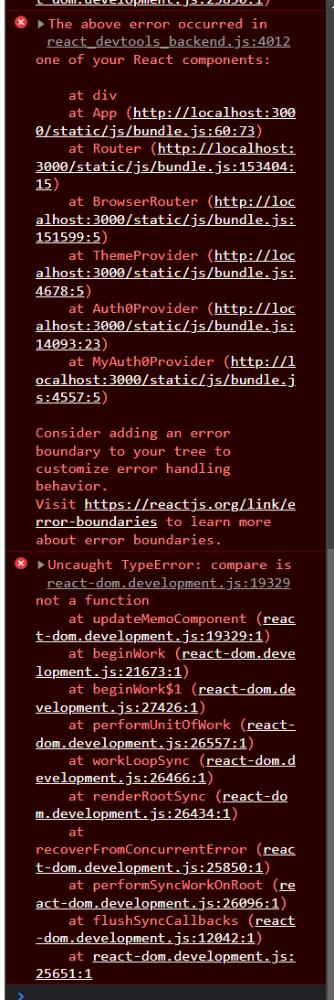
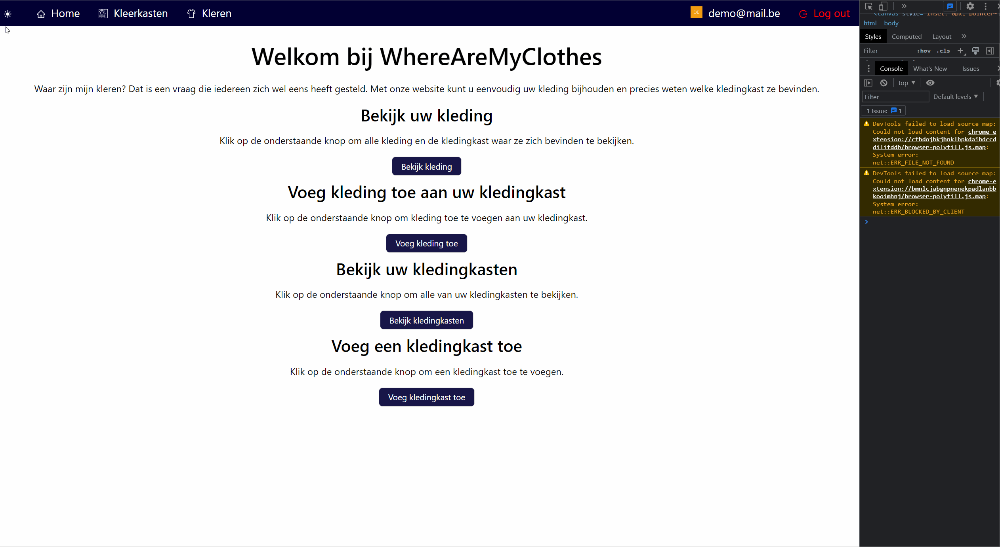

**Beschrijving**
Wanneer het theme wordt aangepast door op de knop in de navigatiebar te klikken, krijg ik deze error :     Ik heb kunnen achterhalen dat deze error niet gebeurd wanneer ik lijn 20 van app.jsx in commentaar zet.

**Probleem reproduceren**
Stappen om het probleem te reproduceren:

1. Start de server d.m.v. de instructies in de README
2. Klik op de maan of zon in de navigatiebar om de theme te veranderen
3. See error

**Verwacht gedrag**
Wanneer op de theme knop wordt gedrukt veranderd de theme zonder dat er een error wordt gesmeten.

**Screenshots**

**Extra context**
/