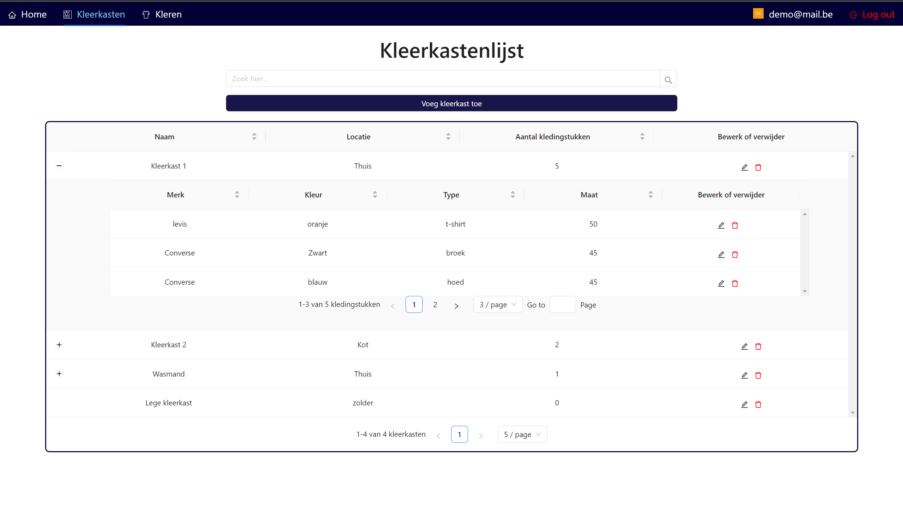

# Where Are My Clothes
Website: [Online versie](https://wherearemyclothes.onrender.com)
 

     
## Project Description

A user can add wardrobes and clothing items, and can check in which wardrobe each clothing item is located. For example, it can be used by a student who wants to know which clothes to take to their dorm room.

## Screenshots

- A list of all your clothing items, where you can search for a specific clothing item to get more information about it, such as its location in the wardrobe.

  

- A list of all your wardrobes, where you can see which clothing items are in each wardrobe.

  

- A page displaying all the information about a specific clothing item, along with all the possible actions you can perform on that clothing item, such as moving it to another wardrobe.

  

- A form where you can create a new clothing item or update an existing one.

  

- A form where you can create a new wardrobe or update an existing one.

  

## Technologies used

The application is built using the following technologies:

- JavaScript
- React
- Ant design (component library)
- MySQL (or any other relational database)
- Custom REST API: [GitHub repository](https://github.com/LouisDeGruyter/WhereAreMyClothes_BackEnd) 
  

