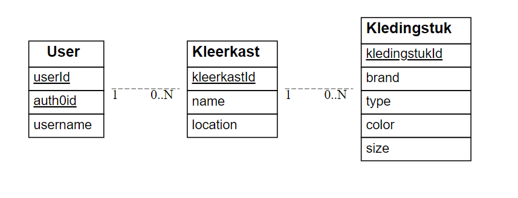
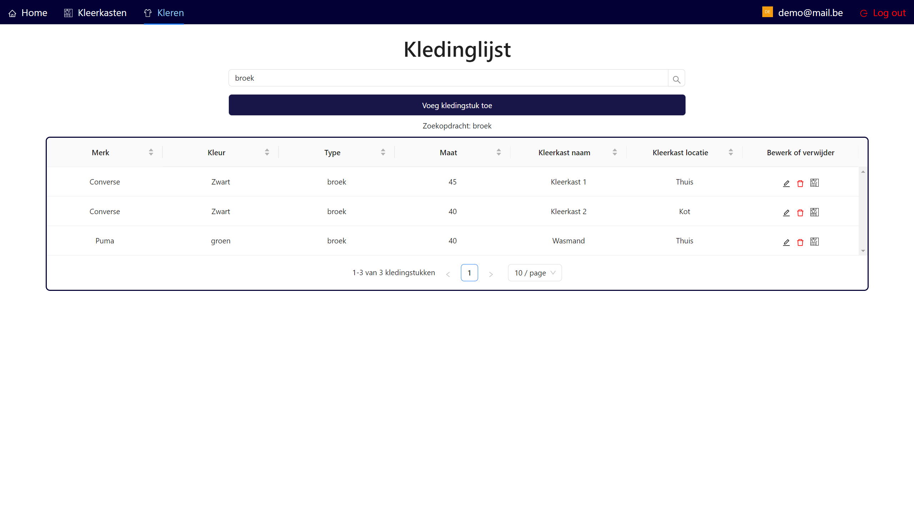
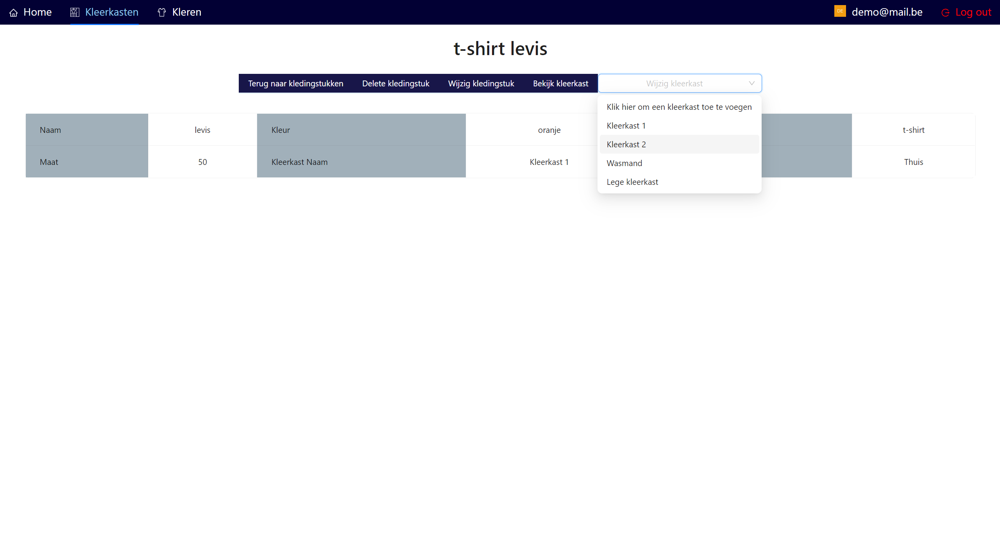
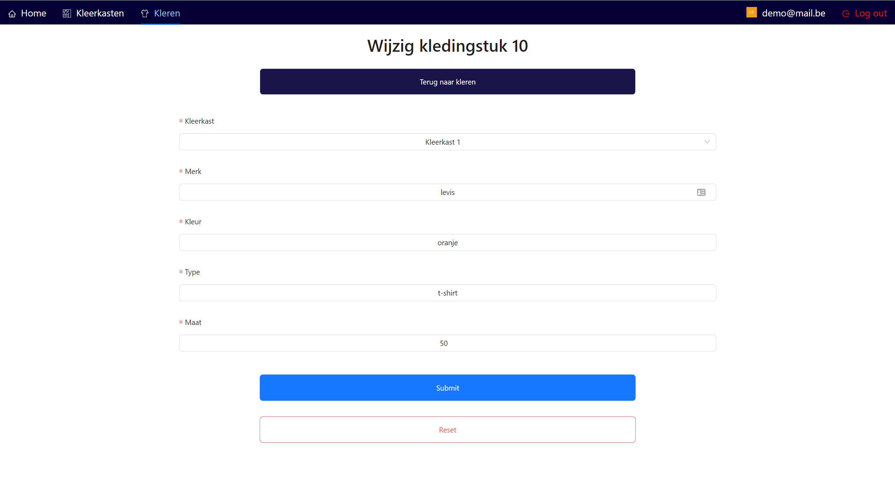
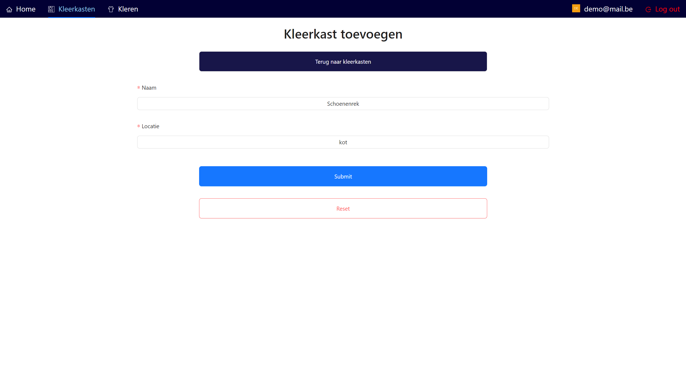
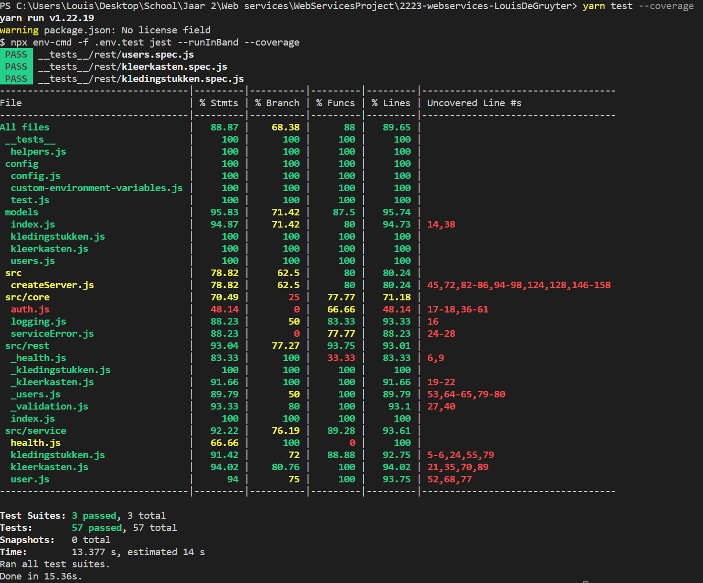
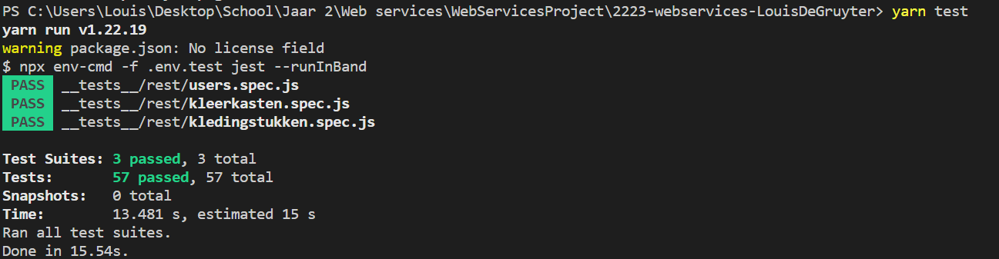

# Louis De Gruyter (180978ld)

- [x] Front-end Web Development
  - [GitHub repository](https://github.com/Web-IV/2223-frontendweb-LouisDeGruyter)
  - [Online versie](https://wherearemyclothes.onrender.com)
- [x] Web Services: GITHUB URL
  - [GitHub repository](https://github.com/Web-IV/2223-webservices-LouisDeGruyter)
  - [Online versie](https://webservices-louisdegruyter.onrender.com)

**Logingegevens**

- e-mailadres: demo@mail.be
- Wachtwoord: Demo@mail

## Projectbeschrijving

Een gebruiker kan kleerkasten en kledingstukken toevoegen en kan zo kijken in welke kleerkast welke kledingstukken zich bevinden. Kan bijvoorbeeld gebruikt worden door een student die wilt weten welke kleren hij nog moet meenemen naar kot.

## Screenshots

- Een lijst van al je kledingstukken, waarin je kan zoeken achter een specifiek kledingstuk om meer informatie er over te weten te komen, zoals in welke kleerkast het zich bevindt.

- Een lijst van al je kleerkasten, waar je kan zien welke kledingstukken in een kleerkast zitten.

- Een pagina waarin alle info van een specifiek kledingstuk, wordt getoond met alle mogelijk acties die je kunt toepassen op dat kledingstuk, zoals het kledingstuk verplaatsen naar een andere kleerkast.

-Een form waarin je een nieuw kledingstuk kan aanmaken of een bestaand kledingstuk kan wijzigen.

- Een form waarin je een kleerkast kan aanmaken of een bestaande kleerkast kan wijzigen

## Behaalde minimumvereisten

### Front-end Web Development

- **componenten**

  - [x] heeft meerdere componenten - dom & slim (naast login/register)
  - [x] definieert constanten (variabelen, functies en componenten) buiten de component
  - [x] minstens één form met validatie (naast login/register)
  - [x] login systeem (eigen of extern zoals bv. Auth0)
 

- **routing**
  - [x] heeft minstens 2 pagina's (naast login/register)
  - [x] routes worden afgeschermd met authenticatie en autorisatie
 

- **state-management**

  - [x] meerdere API calls (naast login/register)
  - [x] degelijke foutmeldingen indien API call faalt
  - [x] gebruikt useState enkel voor lokale state
  - [x] gebruikt Context, useReducer, Redux… voor globale state
 

- **hooks**

  - [x] kent het verschil tussen de hooks (useCallback, useEffect…)
  - [x] gebruikt de hooks op de juiste manier
 

- **varia**
  - [x] een aantal niet-triviale testen (unit en/of e2e en/of ui)
  - [x] minstens één extra technologie
  - [x] duidelijke en volledige README.md
  - [x] volledig en tijdig ingediend dossier

### Web Services

- **datalaag**

  - [x] voldoende complex (meer dan één tabel)
  - [x] één module beheert de connectie + connectie wordt gesloten bij sluiten server
  - [x] heeft migraties
  - [x] heeft seeds
 

- **repositorylaag**

  - [x] definieert één repository per entiteit (niet voor tussentabellen) - indien van toepassing
  - [x] mapt OO-rijke data naar relationele tabellen en vice versa
 

- **servicelaag met een zekere complexiteit**

  - [x] bevat alle domeinlogica
  - [x] bevat geen SQL-queries of databank-gerelateerde code
 

- **REST-laag**

  - [x] meerdere routes met invoervalidatie
  - [x] degelijke foutboodschappen
  - [x] volgt de conventies van een RESTful API
  - [x] bevat geen domeinlogica
  - [x] degelijke authorisatie/authenticatie op alle routes
 

- **varia**
  - [x] een aantal niet-triviale testen (min. 1 controller >=80% coverage)
  - [x] minstens één extra technologie
  - [x] duidelijke en volledige `README.md`
  - [x] maakt gebruik van de laatste ES6-features (object destructuring, spread operator...)
  - [x] volledig en tijdig ingediend dossier

## Projectstructuur

### Front-end Web Development

Alle files die code bevatten om de website op te bouwen bevinden zich in de src folder, dus testen en .env files bevinden zich buiten de src folder, binnen de src folder heb ik files gegroepeerd per functie; files die zorgen voor de connectie met de api in een aparte folder en componenten apart. Binnen de componenten folder zijn de files ook nog eens gegroepeerd per route; de componenten die bijvoorbeeld de route /kledingstukken opbouwen staan in een aparte map.

### Web Services
Ik heb ervoor gezorgd dat alle files die code bevatten voor de werking van de api zich bevinden in de src folder en dat config files, testen en dergelijke zich erbuiten bevinden. Binnen de src folder heb ik files onderverdeeld in aparte lagen: de restlaag, de servicelaag en de datalaag.

## Extra technologie

### Front-end Web Development

De extra technologie is [Ant design](https://github.com/ant-design/ant-design), ant Design is een open-source React UI-bibliotheek. Het bevat vele UI-componenten zoals knoppen, formulieren, tabellen en navigatiemenu's.

### Web Services

De extra technologie is [Sequelize](https://github.com/sequelize/sequelize), Sequelize is een JavaScript-bibliotheek die wordt gebruikt voor het maken en uitvoeren van database-queries in Node.js-toepassingen. Sequelize maakt gebruik van objectrelational mapping (ORM), wat betekent dat het de tabellen in een database omzet naar JavaScript-objecten die je kunt gebruiken in je toepassing.

## Testresultaten

### Front-end Web Development

Er wordt getest of de applicatie draait, of je kleerkasten en kledingstukkken kan toevoegen en verwijderen, of het overzicht van kledingstukken werkt en of het laadscherm enkel zichtbaar is tijdens het laden.

### Web Services

Voor Users, kleerkasten en kledingstukken wordt telkens het opvragen van alles, het opvragen bij id, het updaten, het verwijderen en het aanmaken gecontroleerd. Bij kledingstukken wordt ook nog het opvragen van de user of kleerkast waartoe het behoort gecontroleerd. Bij kleerkasten wordt ook gecontroleerd bij welke user het hoort en welke kledingstukken het bezit.
Bij de users wordt ook nog eens gecontroleerd welke kledingstukken en kleerkasten het bezit

## Gekende bugs

### Front-end Web Development
Geen gekende bugs

### Web Services
Geen gekende bugs

